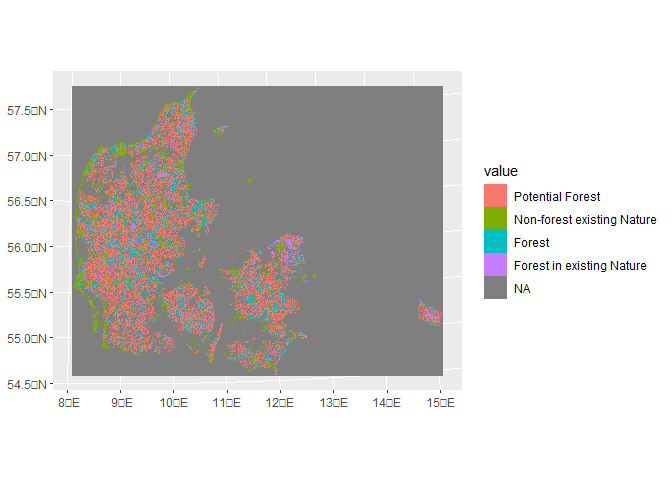

<!-- README.md is generated from README.Rmd. Please edit that file -->

# Klimaskovfond

<!-- badges: start -->
<!-- badges: end -->

The goal of Klimaskovfond is to generate the needed data sets to get
analize the Klimaskovfond score system

## Overview of Forest Patches

We have a total of 533,500 forest patches, with sizes ranging from 0.01
to 1,228.918 hectares. The distribution of forest patch areas is
visualized below:

<!-- -->

Next, let’s focus on forest patches larger than 2 hectares.

Out of the total forest patches, only 30,697 correspond to patches
larger than 2 hectares. The distribution of these larger patches is
visualized below:

<!-- -->

## Species Area Relationship Analysis

To determine the optimal forest patch size for biodiversity
preservation, we conducted a Species Area Relationship analysis using
the sars R package. The analysis utilized GBIF data on species presences
within forest polygons from 1999 to 2023, resolving synonyms.

The distribution of species across kingdoms is summarized below:

| Kingdom   | Percentage |
|:----------|-----------:|
| Plantae   |      52.53 |
| Animalia  |      28.11 |
| Fungi     |      19.09 |
| Protozoa  |       0.25 |
| Chromista |       0.02 |
| Bacteria  |       0.01 |

Additionally, we present the top 10 classes with the highest
proportions:

| kingdom  | phylum        | class           | Percentage | Cumulative_Percentage |
|:---------|:--------------|:----------------|-----------:|----------------------:|
| Plantae  | Tracheophyta  | Magnoliopsida   |      33.60 |                 33.60 |
| Animalia | Chordata      | Aves            |      17.12 |                 50.72 |
| Fungi    | Basidiomycota | Agaricomycetes  |      15.41 |                 66.13 |
| Plantae  | Tracheophyta  | Liliopsida      |      13.98 |                 80.11 |
| Animalia | Arthropoda    | Insecta         |       8.27 |                 88.38 |
| Plantae  | Tracheophyta  | Polypodiopsida  |       1.82 |                 90.20 |
| Plantae  | Bryophyta     | Bryopsida       |       1.60 |                 91.80 |
| Animalia | Chordata      | Mammalia        |       1.05 |                 92.85 |
| Fungi    | Ascomycota    | Sordariomycetes |       1.01 |                 93.86 |
| Plantae  | Tracheophyta  | Pinopsida       |       0.92 |                 94.78 |

# Species Area Relationship for Different Groups

Now, we perform a species area relationship analysis for three groups:
plants and animals together, plants only, and animals only.

Plants and Animals

Here we can see the table of selected models:

| Model    | Weight |      AIC |    R2 |   R2a | Shape     | Asymptote | CumWeight |
|:---------|-------:|---------:|------:|------:|:----------|:----------|----------:|
| ratio    |      1 | 239029.7 | 0.430 | 0.430 | convex up | TRUE      |         1 |
| asymp    |      0 | 239054.0 | 0.430 | 0.429 | convex up | TRUE      |         1 |
| p1       |      0 | 239066.5 | 0.429 | 0.429 | convex up | FALSE     |         1 |
| weibull4 |      0 | 239078.7 | 0.429 | 0.429 | convex up | FALSE     |         1 |
| p2       |      0 | 239079.2 | 0.429 | 0.429 | sigmoid   | FALSE     |         1 |
| weibull3 |      0 | 239079.4 | 0.429 | 0.429 | convex up | FALSE     |         1 |
| heleg    |      0 | 239081.3 | 0.429 | 0.429 | convex up | FALSE     |         1 |
| betap    |      0 | 239083.8 | 0.429 | 0.429 | convex up | FALSE     |         1 |
| powerR   |      0 | 239087.6 | 0.429 | 0.429 | convex up | FALSE     |         1 |
| power    |      0 | 239093.5 | 0.428 | 0.428 | convex up | FALSE     |         1 |
| epm1     |      0 | 239095.3 | 0.428 | 0.428 | convex up | FALSE     |         1 |
| epm2     |      0 | 239095.4 | 0.428 | 0.428 | convex up | FALSE     |         1 |
| koba     |      0 | 239589.8 | 0.415 | 0.415 | convex up | FALSE     |         1 |
| monod    |      0 | 239791.6 | 0.409 | 0.409 | convex up | TRUE      |         1 |
| gompertz |      0 | 239845.9 | 0.407 | 0.407 | sigmoid   | TRUE      |         1 |
| negexpo  |      0 | 240025.4 | 0.402 | 0.402 | convex up | TRUE      |         1 |
| linear   |      0 | 240385.6 | 0.392 | 0.392 | linear    | FALSE     |         1 |
| logistic |      0 | 240447.2 | 0.390 | 0.390 | sigmoid   | TRUE      |         1 |
| loga     |      0 | 243228.7 | 0.302 | 0.302 | convex up | FALSE     |         1 |
| chapman  |      0 | 250693.8 | 0.000 | 0.000 | linear    | TRUE      |         1 |

and the plot of the relationship

<!-- -->

## Plants only

Now we fit the same model but for plants only

Here we can see the table of selected models:

| Model    | Weight |      AIC |    R2 |   R2a | Shape     | Asymptote | CumWeight |
|:---------|-------:|---------:|------:|------:|:----------|:----------|----------:|
| p2       |  0.958 | 173087.1 | 0.339 | 0.339 | sigmoid   | FALSE     |     0.958 |
| powerR   |  0.042 | 173093.3 | 0.339 | 0.339 | convex up | FALSE     |     1.000 |
| ratio    |  0.000 | 173112.6 | 0.338 | 0.338 | convex up | TRUE      |     1.000 |
| epm1     |  0.000 | 173124.7 | 0.338 | 0.338 | convex up | FALSE     |     1.000 |
| epm2     |  0.000 | 173132.3 | 0.338 | 0.337 | convex up | FALSE     |     1.000 |
| power    |  0.000 | 173224.9 | 0.334 | 0.334 | convex up | FALSE     |     1.000 |
| p1       |  0.000 | 173226.9 | 0.334 | 0.334 | convex up | FALSE     |     1.000 |
| heleg    |  0.000 | 173226.9 | 0.334 | 0.334 | convex up | FALSE     |     1.000 |
| weibull3 |  0.000 | 173226.9 | 0.334 | 0.334 | convex up | FALSE     |     1.000 |
| weibull4 |  0.000 | 173228.9 | 0.334 | 0.334 | convex up | FALSE     |     1.000 |
| betap    |  0.000 | 173295.5 | 0.331 | 0.331 | convex up | FALSE     |     1.000 |
| asymp    |  0.000 | 173356.6 | 0.328 | 0.328 | convex up | FALSE     |     1.000 |
| gompertz |  0.000 | 173431.7 | 0.325 | 0.325 | sigmoid   | TRUE      |     1.000 |
| logistic |  0.000 | 173674.7 | 0.315 | 0.315 | sigmoid   | TRUE      |     1.000 |
| linear   |  0.000 | 173969.8 | 0.302 | 0.302 | linear    | FALSE     |     1.000 |
| koba     |  0.000 | 174106.3 | 0.296 | 0.296 | convex up | FALSE     |     1.000 |
| loga     |  0.000 | 174980.7 | 0.257 | 0.257 | convex up | FALSE     |     1.000 |
| monod    |  0.000 | 174693.1 | 0.270 | 0.270 | convex up | TRUE      |     1.000 |
| negexpo  |  0.000 | 175213.5 | 0.247 | 0.247 | convex up | TRUE      |     1.000 |
| chapman  |  0.000 | 179804.3 | 0.000 | 0.000 | sigmoid   | TRUE      |     1.000 |

and the plot of the model

<!-- -->

## Animals only

Now we fit the same model but for Animals only

Here we can see the table of selected models:

| Model    | Weight |      AIC |    R2 |   R2a | Shape     | Asymptote | CumWeight |
|:---------|-------:|---------:|------:|------:|:----------|:----------|----------:|
| weibull4 |      1 | 176603.6 | 0.299 | 0.299 | convex up | TRUE      |         1 |
| ratio    |      0 | 176646.0 | 0.297 | 0.297 | convex up | TRUE      |         1 |
| p1       |      0 | 176651.3 | 0.297 | 0.296 | convex up | FALSE     |         1 |
| weibull3 |      0 | 176659.7 | 0.296 | 0.296 | convex up | TRUE      |         1 |
| betap    |      0 | 176662.7 | 0.296 | 0.296 | convex up | TRUE      |         1 |
| heleg    |      0 | 176662.8 | 0.296 | 0.296 | convex up | FALSE     |         1 |
| epm1     |      0 | 176678.6 | 0.295 | 0.295 | convex up | FALSE     |         1 |
| epm2     |      0 | 176682.0 | 0.295 | 0.295 | sigmoid   | FALSE     |         1 |
| power    |      0 | 176682.4 | 0.295 | 0.295 | convex up | FALSE     |         1 |
| p2       |      0 | 176684.3 | 0.295 | 0.295 | convex up | FALSE     |         1 |
| powerR   |      0 | 176684.4 | 0.295 | 0.295 | convex up | FALSE     |         1 |
| koba     |      0 | 176756.5 | 0.292 | 0.292 | convex up | FALSE     |         1 |
| monod    |      0 | 176782.0 | 0.291 | 0.291 | convex up | TRUE      |         1 |
| negexpo  |      0 | 176810.6 | 0.290 | 0.289 | convex up | TRUE      |         1 |
| asymp    |      0 | 176840.1 | 0.288 | 0.288 | convex up | FALSE     |         1 |
| gompertz |      0 | 177038.7 | 0.280 | 0.280 | sigmoid   | TRUE      |         1 |
| linear   |      0 | 177081.5 | 0.278 | 0.278 | linear    | FALSE     |         1 |
| logistic |      0 | 177368.9 | 0.265 | 0.265 | sigmoid   | TRUE      |         1 |
| loga     |      0 | 178774.3 | 0.199 | 0.199 | convex up | FALSE     |         1 |
| chapman  |      0 | 182390.6 | 0.000 | 0.000 | sigmoid   | TRUE      |         1 |

and the plot of the model

<!-- -->

# Buffer and intersection generation

## Tasks needed

- Existing nature (A), add a 5 ha buffer, add jakob’s Forest dataset
- A = Existing nature
- B = Jakobs Forest or Fredskov
- Buffer \~5 Ha (225m) around B butcannot be part of A, and has to be a
  part of agriculture
- For every buffer patch we calculate the contiguity with B and A
  patches and calculate total area and proportion of forest within A and
  B and add Lavbund proportion

## Read A and plot

## Existing Nature (A) and Forest (B) Datasets

We begin by loading the existing nature dataset (A) and the dataset
representing deciduous forest areas from Jakob Assmann’s work, which
we’ll refer to as B.

## Agricultural Land Dataset

Next, we acquire the dataset that represents agricultural land in
Denmark. This information is crucial, as we want to ensure that the
newly created forested areas are restricted to the existing agricultural
land.

## Generating a Buffer around Deciduous Forest

We generate a 225-meter buffer around the deciduous forest areas,
approximating a 5-hectare squared region.

This script creates a buffer around deciduous forest areas, ensuring it
conforms to the specified conditions and constraints. The resulting
buffer is then saved as a Cloud-Optimized GeoTIFF (COG) file named
“Buffer_all_225.tif.”

We can now visualize all this categories

<!-- -->

Now in order to calculate areas and adjacencies the raster will be
transformed into polygons

Now to actually calculate the values we will first unite resolve for A
and B join them in the largest possible polygons

Now we filter form the joint polygons only the ones with areas higher
than 200 ha, 100 Ha, 50 Ha and 25 Ha

Now we go one by one and we generate the potential forest content

### 200 ha

And now we transform this into polygons

We now we process the potential forest to add total area considering AB
(Total_Area), the area of the potential forest is included (Ha), we
caclulate the area of forest considering the adjacent A and B areas,
Forest_Area

### 100 ha

And now we transform this into polygons
